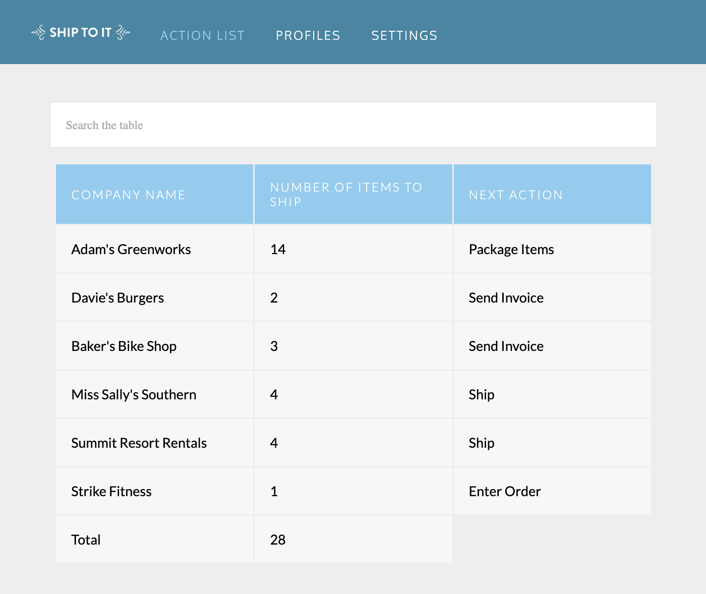

# companyPackingListProject

# About the project
This project is part of Codecademy's Bootcamp.
During the studies on HTML fundamentals, the site was created to demonstrate how to include tables in the web page.  
https://codepen.io/celiceceron/full/ZEjRJoZ

## Layout web

# Technologies and tools I use
## Front end
- HTML
- CSS 

# Autor
Celice Ceron  
https://www.linkedin.com/in/celice-ceron/
